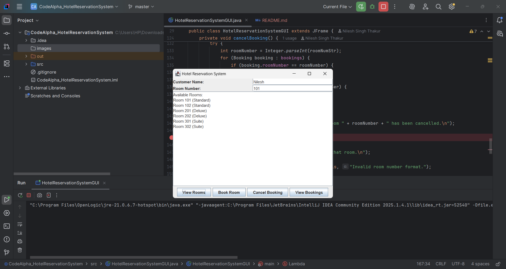

# CodeAlpha_HotelReservationSystem

## 📌 Overview
This is a **Java GUI application** developed as part of my **CodeAlpha Java Programming Internship**.  
It allows users to manage hotel reservations with the ability to:

- View available rooms
- Book a room
- Cancel a booking
- View all current bookings

## 🛠 Features
- Graphical interface built using **Java Swing**
- Room categories: Standard, Deluxe, Suite
- Real-time updates on bookings
- Simple and user-friendly design

## 🚀 How to Run
1. Clone this repository:
   ```bash
   git clone https://github.com/<your-username>/CodeAlpha_HotelReservationSystem.git
2. Open the project in IntelliJ IDEA.

3. Run HotelReservationSystemGUI.java
## 📂 Project Structure
```
CodeAlpha_HotelReservationSystem/
 ├── src/
 │    └── HotelReservationSystemGUI.java
 └── README.md
```


📜 License

This project is part of the CodeAlpha Java Programming Internship and is intended for educational purposes.