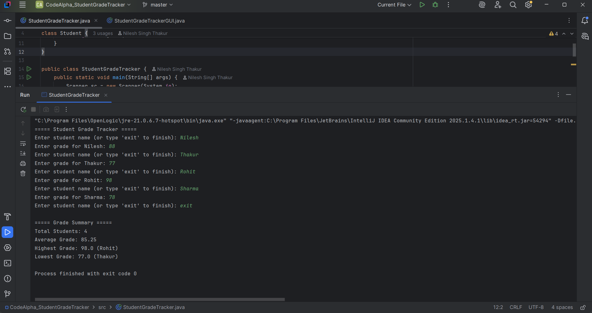
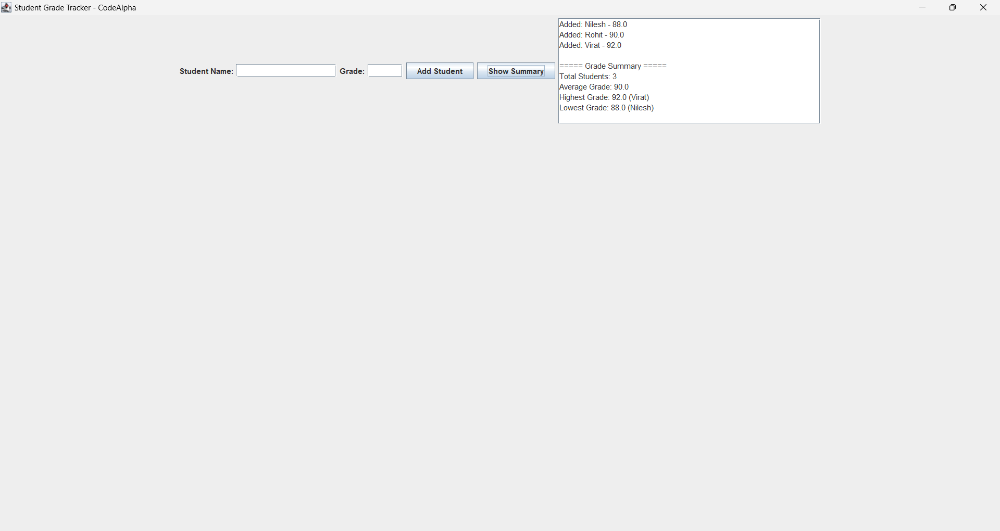

# CodeAlpha Java Internship – Tasks
This repository contains my completed tasks for the **CodeAlpha Java Programming Internship**.  
I have implemented the following projects:

---

## 📘 Student Grade Tracker
A Java console + GUI application that allows users to manage student grades.  
It calculates and displays:
- Average grade
- Highest grade
- Lowest grade
- Total number of students

### Screenshots  
Console Output:  
  

GUI Interface:  
  

 ---

## 🏨 Hotel Reservation System
A simple hotel reservation management system built with Java.  
It allows users to:
- View available rooms
- Make reservations
- Manage basic booking details

### Screenshot  
  

## 📂 Repository Structure
```plaintext
codealpha_tasks/
├── StudentGradeTracker/
│ ├── src/
│ │ ├── StudentGradeTracker.java
│ │ └── StudentGradeTrackerGUI.java
│ ├── images/
│ │ ├── console.png
│ │ └── GUI.png
│ └── README.md
├── HotelReservationSystem/
│ ├── src/
│ │ └── HotelReservationSystemGUI.java
│ ├── images/
│ │ └── viewrooms.png
│ └── README.md
└── README.md
```
```plaintext
## 🏆 Internship Info
- **Domain:** Java Programming  
- **Batch:** August 2025  
- **Organization:** CodeAlpha
```

 


